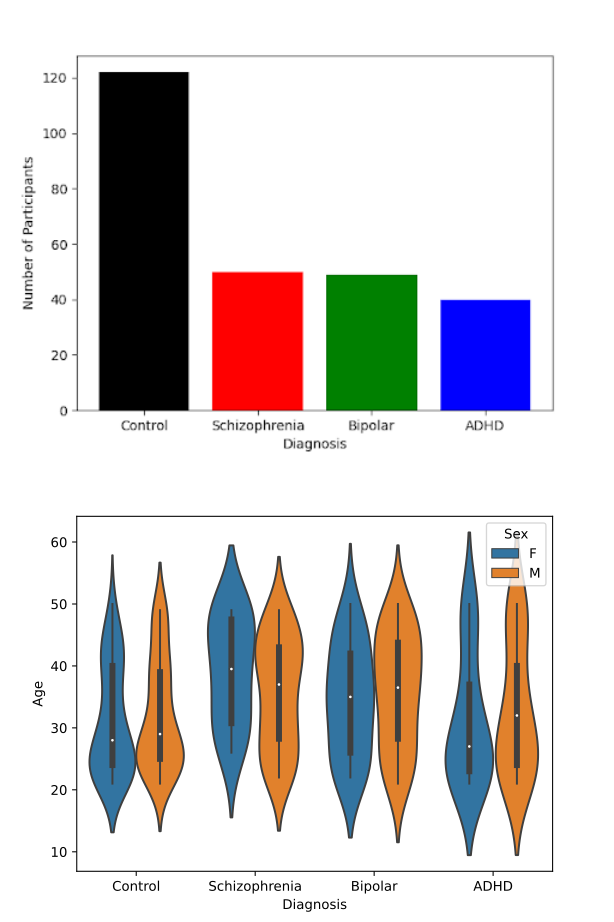
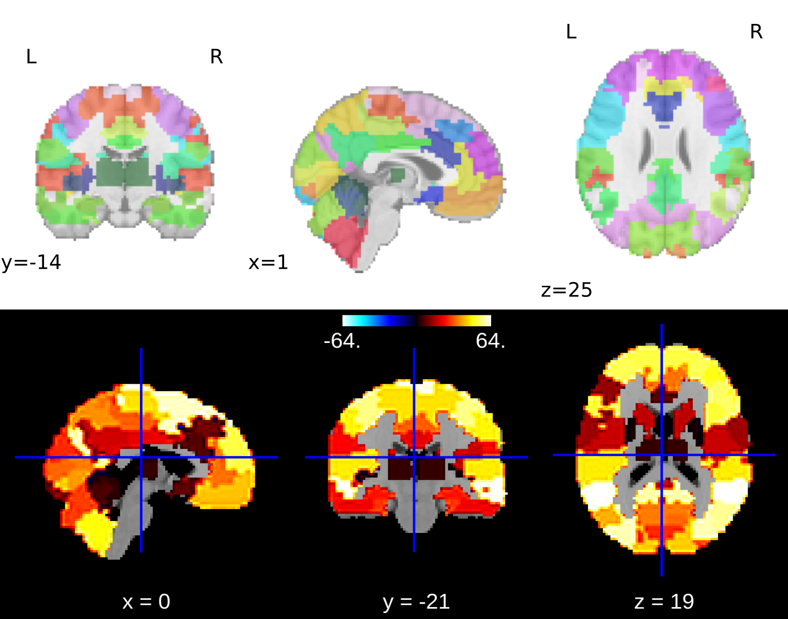
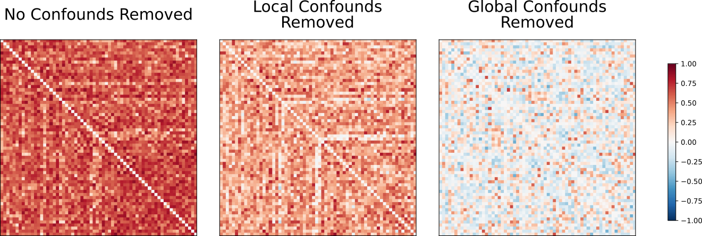
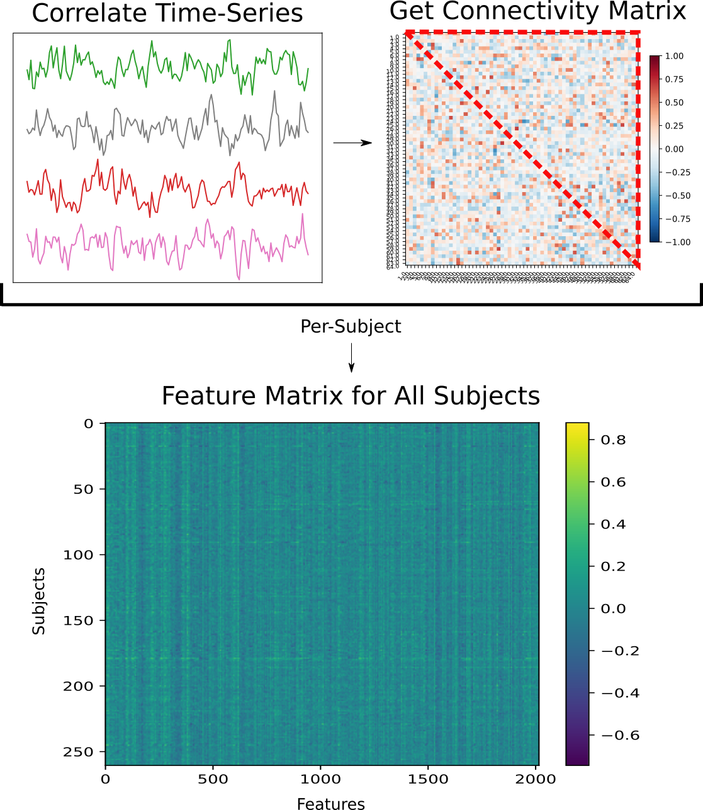

# Classifying Neuropsychiatric Disorder Diagnoses Using Resting State BOLD fMRI Connectovoty Data

## About Me

<a href="https://github.com/PeteBro">
   
   <br /><sub><b>Peter Brotherwood</b></sub>
</a>

I am a first year PhD student at the University of Montreal studying in computational neuroscience. I come from a fairly different background, with a BSc in Genetics and an MSci in Bioinformatics from the University of Birmingham. Much of my current work is in perception, using machine learning based approaches to model representational spaces in individual subjects. My hope is that BHS will introduce me to tools and best prectices I need to learn in order to fully integrate into the field of computational cognitive neuroscience.
## Project Summary

### Introduction
Brain regions with correlated temporal activity are seen to form functional networks of varying scale and distribution. Regions correlated at rest form resting state networks. Aberrant functional connectivity of resting state networks has been observed in multiple populations sufering from neuropsychiatric disorders; including ADHD (Sudre *et al*., 2017), Bipolar Disorder (Syan *et al*., 2018), and Schizophrenia (Sheffield & Barch, 2016). Given these observed differences in resting state network connectivity, this project aims to apply machine learning methods to investigate if aberrations in resting state functional connectvitiy can be used to identify neurophychiatric diagnoses.

### Main Objectives
- Provide a full neuroimaging workflow from preprocessing of raw data to visualisation of results.
- Emphasize reproducibility, making all elements of the project as reproducible as possible.
- Investigate ability of machine learning algorithms in predicting phenotype based on connectivity data.

### Personal Objectives
- Learn more about open data and project reproducibility.
- Gain an understanding of fMRI and neuroimaging database structures and best practices.
- Develop skills in proprocessing and analysis of fMRI data.
- Apply knowledge of machine learning to neuroscientfic studies.

### Tools
- Compute Canada for Job Submission
- Git and Github for Version Control
- DataLad for Reproducibility
- Singularity for Reproducibility
- fMRIPrep for data preprocessing
- Python Packages: `matplotlib`, `seaborn`, `scikit-learn`, `nilearn`

### Data
The dataset used in this study comes from the UCLA Consortium for Neuropsychiatric Phenomics LA5c Study (Poldrack *et al*., 2016). The dataset is comprised of fMRI data for 130 healthy individuals, and 142 individuals with neuropsychiatric disorders. Of these 148 individuals, 50 suffer from schizophrenia, 49 from bipolar disorder, and 43 from ADHD. The dataset contains fMRI data collected at rest and over a series of attentional tasks. The fMRI data is in nifti format and the dataset is provided in BIDS format. More information on this dataset can be found at https://openneuro.org/datasets/ds000030/versions/1.0.0.

A summary of the dataset is as follows:

|              |Participants|Male|Female|Average Age|Age Std|
|:-------------|:----------:|:--:|:----:|:---------:|:-----:|
|Control       |122         |65  |57    |32.05      |10.28  |
|Schizophrenia |50          |38  |21    |35.29      |8.94   |
|Bipolar       |49          |28  |19    |31.59      |8.77   |
|ADHD          |40          |21  |12    |36.46      |8.79   |
|Total         |261         |152 |109   |33.29      |9.29   |

<p align="center">

</p>

### Project Deliverables
- Reproducible project workflow, detailed in git repo and via datalad logs, reproducible via containers.
- Executable Python scripts for data preparation and machine learning
- Markdown file introducing the project and detailing project results

## Results

### Preprocessing using `fMRIprep`

Preprocessing of raw fMRI data was done using `fMRIprep` (Esteban *et al*., 2018) and executed via the `prepreocessing.sh` script on Alliance Canada's Beluga HPC Cluster. Due to lack of resting state data for \
some subjects, 260 preprocessed resting state BOLD fMRI and their associated confound files were returned. fMRIprep was run using singularity 3.8 and subjected the data to the following steps:

- Brain masking and tissue segementation of T1w image
- Spatial normalization of the anatomical T1w reference
- Surface reconstruction using FreeSurfer
- Alignment of functional and anatomical MRI data
- Brain masking and confound extraction

To see a full report on preprocessing for each subject, see [here](https://github.com/brainhack-school2022/brotherwood_project/tree/master/data/derivatives/html_reports).

### Getting Connectivity Data using `nilearn`

Brain masking and connectivity data retrieval was done using `nilearn` (Abraham *et al*., 2014). The BASC multiscale deterministic atlas (Bellec *et al*., 2009) with 64 regions of interest (ROIs) was used to \
mask the preprocessed voxel-wise BOLD activity data, in order to reduce the complexity of the features. A plot of this atlas can be seen below:

<p align="center">

</p>

Confounds detected by `fMRIprep` were loaded using `nilearn`'s `load_confounds_strategy` method and regressed out during masking. Following this, connectivity matrices showing correlations in BOLD \
timeseries activity between ROIs were generated for each subject. The impact of confound removal strategy on the output connectivity matrices can be seen below:

<p align="center">

</p>

The upper triangular vector (UTV) of each subject's connectivity matrix forms a set of features which will serve as input to the machine learning step. The UTVs of all matrices can be combined to form \
a feature matrix:

<p align="center">

</p>

### Machine Learning using `scikit-learn`

## Guide to Reproducibility
All scripts used in the analyses are located in the `scripts` directory and are executable in the Linux command line. Each script is written such that it can be executed using fMRI data from alternative functional tasks from the same dataset, or with similar datasets conforming to BIDS formatting standards. The `requirements.txt` file provides all neccesary dependencies for execution of scripts following preprocessing using fMRIprep.

A basic example of running the contents of the `scripts` directory on a Linux machine is as follows:

### Running fMRIprep

To run `mriprep.sh` it is highly recommended to use a HPC cluster, more instructions on preprocessing requirements and how to properly format `mriprep.sh` can be found at https://www.nipreps.org/apps/singularity/.

Following correct installation and formatting, preprocessing can be run by running `$ sbatch mriprep.sh`

### Setting up a virtual environment for running the python scripts
```
$ cd <path_to_cloned_repo> # go to project directory

$ python3 -m venv <venv_name> # initialize virtual environment

$ source <path_to_venv>/bin/activate # enter the virtual environment

(<venv_name>) $ pip install --upgrade pip # upgrade the package manager

(<venv_name>) $ pip install -r requirements.txt # install project dependencies
```

*What follows is a basic usage tutorial on `.py` scripts in the `scripts` directory; for more information on each script and its associated parameters use:* `scripts/<script_name>.py -h`

### Getting connectivity data
```
$ source <path_to_venv>/bin/activate # enter the virtual environment

(<venv_name>) $ scripts/format_data.py <path_to_derivatives_file> <preprocessed_bold_file_suffixes> # create an index file in the derivatives folder for use with other python scripts

(<venv_name>) $ scripts/get_connectivity_data.py <path_to_derivatives_file> <path_to_atlas> # get individual subject connectomes
```

### Fitting a Support Vector Classifier
```
$ source <path_to_venv>/bin/activate # enter the virtual environment

(<venv_name>) $ scripts/fit_svm.py <path_to_derivatives_file> # perform a parameter search and find the best fitting model
```

### Troubleshooting
In the instance that attempting to run a script returns `permission denied`, it may be neccesary to run `(<venv_name>) $ chmod +x scripts/<script_name>.py`. Alternatively running `(<venv_name>) $ python3 scripts/<script_name>.py <args>` will execute the scripts.

## References
Poldrack, R., Congdon, E., Triplett, W., Gorgolewski, K., Karlsgodt, K., Mumford, J., Sabb, F., Freimer, N., London, E., Cannon, T. and Bilder, R., 2016. A phenome-wide examination of neural and cognitive function. *Scientific Data*, 3(1).

Sheffield, J. and Barch, D., 2016. Cognition and resting-state functional connectivity in schizophrenia. *Neuroscience; Biobehavioral Reviews*, 61, pp.108-120.

Sudre, G., Szekely, E., Sharp, W., Kasparek, S. and Shaw, P., 2017. Multimodal mapping of the brain’s functional connectivity and the adult outcome of attention deficit hyperactivity disorder. *Proceedings of the National Academy of Sciences*, 114(44), pp.11787-11792.

Syan, S., Smith, M., Frey, B., Remtulla, R., Kapczinski, F., Hall, G. and Minuzzi, L., 2018. Resting-state functional connectivity in individuals with bipolar disorder during clinical remission: a systematic review. *Journal of Psychiatry and Neuroscience*, 43(5), pp.298-316.
